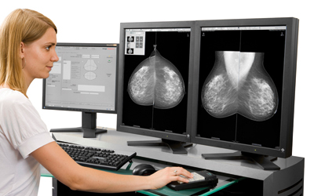

## 예제 

유방암을 진단하는 검사 방법중의 하나인 유방촬영검사(Mammography) 검진법은 의료 전문가들 사이에서도 효용성 논란이 일고 있다고 합니다. 왜 그런지  좀더 알아보기 위하여 다음과 같은 배경지식을 가정하도록 합시다. (이 값은 실제와는 조금 다를수 있습니다.)

1. 성인 여성중 1%가 유방암에 걸린다. 
2. 유방촬영검사는 유방암이 있는 경우 80%를 발견한다. (따라서 유방암이 있는 여성의 20%를 놓친다.) 
3. 유방촬영검사는 유방암이 없는 경우에도 10%를 유방암이 있는 것으로 판독한다 (따라서 유방암이 없는 여성의 90%를 정상으로 밝혀낸다.)

이러한 경우 어떤 여성이 이 검사에서 양성 결과가 나왔다면 이 환자가 진짜로 유방암에 걸렸을 확률은 얼마인가요? 

## 풀이  

이 문제는 베이즈 정리를 이용한 사후 확률을 계산하는 가장 대표적인 예 중의 하나입니다. 현실 세계에서는 검사결과와 질병유무가 완전히 일치하지 않기 때문에 우리는 검사결과로 부터 질병 유무를 알아내고 싶을 때 사후 확률을 계산하고자 합니다. 검사 결과와 질병 유무에 따른 각 경우의 분류는 다음과 같습니다. 

| 검사결과 | 질병 유 | 질병 무 |
|----------|---------|---------|
| 양성(positive)| 진양성(true positive) | 위양성(false positive) | 
| 음성(negative)| 위음성 (false negative) | 진음성 (true negative) |
| | | |

위의 유방암 예제에서는 1%만이 유방암 환자이므로 10,000 명 중에 100명이 유방암 환자이고 9,900 명이 정상입니다. 따라서 100명의 환자 중에서 검사에서 양성을 갖는 진양성 환자는 80명이 될 것이고 그렇지 않은 위음성 환자는 20명이 될 것입니다. 또한 9,900명의 정상인 중에서 10%인 990명은 검사가 양성을 가지는 위양성 환자가 되고 나머지 90%인 8,910명은 검사가 음성을 가지는 진음성 환자가 됩니다. 따라서 이를 도표로 정리하면 다음과 같습니다. 

| 검사결과 | 질병 유 | 질병 무 |  합계 |
|----------|---------:|---------:|-----:|
| 양성(positive)| 80 | 990 |  1,070 | 
| 음성(negative)| 20 | 8,910 | 8,930 |
| | | | | 

따라서 검사 결과가 양성이 나왔더라도 대부분은 1만명 중의 990명에 해당되는 위양성 그룹에서 나온 것입니다. 검사 결과가 양성인 사람 중에서 실제 질병이 있는 사람의 비율은 $80/1,070 \doteq 0.0748$, 즉, 7.48\% 에 불과한 것입니다. 

## 토론 

1. 질병 진단법의 정확성은 두가지 측면에서 계산됩니다. 하나는 민감도(sensitivity)라고 불리는 것으로써 질병이 있는 사람 중에서 얼마나 높은 비율로 양성을 찾아내느냐 하는 것입니다. 다른 하나는 특이도(specificity)라고 불리는 것으로써 질병이 없는 사람 중에서 얼마나 많이 음성 결과를 얻어 내느냐를 나타냅니다. 위의 유방촬영검사는 80%의 민감도와 90%의 특이도를 가진다고 할수 있을 것입니다. 

2. 베이즈 정리는 증거를 바탕으로 사건이 일어날 확률을 사후적으로 계산하는 방법에 관한 정리입니다. 위의 예에서 검사 결과가 양성이라는 것은 하나의 증거입니다. 이 증거를 통해서 해당 여성의 유병 확률은 1%에서 7.48% 로 높아지게 되는 것입니다. 이를 수식으로 나타내면 다음과 같습니다. 
\begin{eqnarray*}
P(\mbox{Cancer }  \mid  \mbox{ Positve} ) &=& \frac{ P( \mbox{Cancer }  \&  \mbox{ Positve} ) }{ P( \mbox{ Positive} )}
\\
&=& \frac{ P( \mbox{Cancer} ) P( \mbox{ Positive} \mid \mbox{Cancer} )}{P( \mbox{Cancer}) P( \mbox{ Positive}  \mid \mbox{Cancer}) + P( \mbox{Normal} ) P( \mbox{ Positive} \mid \mbox{ Normal}) }\\
&=& \frac{ 0.01 \times 0.8}{ 0.01\times 0.8 + 0.99 \times 0.1  }=0.07476636 . 
\end{eqnarray*}

3. 이렇게 상태가 두개인 경우 (질병 유무)에는 사후 확률을 Odd 를 이용해서 계산하는게 더 쉽습니다. 위의 조건부 확률 공식을 사용하면 질병 유무에 대한 사후 확률의 비는 다음과 같이 표현될수 있습니다. 
$$ \frac{  P(\mbox{ Cancer}  \mid  \mbox{ Positve} )
}{
P(\mbox{ Normal}  \mid  \mbox{ Positve} )
} = \frac{P( \mbox{ Positive} \mid \mbox{ Cancer} ) }{P( \mbox{ Positive} \mid \mbox{ Normal}  ) } \times \frac{P( \mbox{Cancer} ) }{P(\mbox{Normal})}. $$
위의 식에서 등식 오른쪽의 두번째 항은 초기 확률의 비입니다. 거기에 "Test positive"라는 증거를 반영한 보정 승수(evidence adjustment factor) 
$$ \frac{P( \mbox{ Positive} \mid \mbox{ Cancer} ) }{P( \mbox{ Positive} \mid \mbox{ Normal}  ) } $$
을 곱해서 사후 확률의 비를 계산하게 되는 것입니다. 위의 유방암 검진 사례를 이용하면 초기 유방암 발생 비율은 암:정상의 비율이  1:99 입니다. 그런데 테스트 결과가 양성인 경우의 증거 보정 승수는 (0.8/0.1)=8 로 계산됩니다. 따라서 테스트 양성을 관측한 후의 암:정상의 비율은 8:99 가 되는 것입니다. 따라서 이 경우 사후 확률은 8/(8+99)=0.07476636 으로 위의 결과와 동일해 지는 것입니다. 

4. 만약 검사를 한번 더 했다면 어떻게 될까요? 즉, 검사를 두번 독립적으로 실시해서 둘다 양성이 나왔다면 어떻게 될까요? 그러면 증거 보정 승수는 8*8=64 으로 높아지고 따라서 사후 확률은 64/(64+99)=0.392638 으로 계산됩니다. 즉, 두번 다 양성 결과가 나왔다고 하더라도 그 사람이 실제 유방암 환자일 확률은 39\% 밖에 되지 않는다는 것입니다. 

5. 이처럼 확률은 증거를 통해서 계속 업데이트 됩니다. 유방암 관련 초기 확률이 1\% 에서 일회의 양성 결과를 통해 7.48\% 라는 값으로 업데이트 되었고 그 확률은 다시 한번의 양성 결과를 통과하면 39\% 로 높아집니다. 즉, 1회 관측으로 얻어진 사후 확률이 제 2회 관측을 반영하는 사후 확률 계산에서는 사전 확률로 사용되는 것입니다. 

