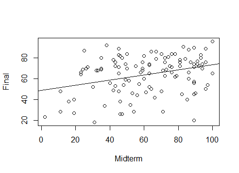

## 예제 

김재광 교수는 지난 학기에 카이스트에서 통계학 개론 과목을 강의했습니다. 그런데 홍길동(가명)이라는 학생이 기말고사 기간에 미국에서 열리는 학회에 참석해야 해서 시험을 치룰수 없게 되었다고 하면서 어떻게 해야 할지 알려달라는 문의 메일을 보내온 것이었습니다. 김재광 교수는 중간고사 성적만으로 그 학생의 기말 고사 점수를 예측해서 그 예측점수의 90%에 해당하는 값을 그 학생의 기말고사 점수로 대체해서 최종 성적을 내겠다고 공지했습니다. 이럴 경우 어떻게 해야 합리적인 방법으로 홍길동 학생의 기말 고사 성적  예측을 할 수 있을까요? 

## 풀이  

다른 분야에서도 그렇겠지만 특히 통계학에서는 지금까지 관측된 자료를 바탕으로 일어나지 않은 사건에 대한 예측을 하는 것이 주된 관심사 중의 하나입니다. 위의 예제처럼 중간고사 성적을 $X$ 라고 하고 기말고사 성적을 $Y$라고 한다면 다른 학생들의 $X$와 $Y$의 관계를 이용해서 통계적 모형을 세운후 이 모형을 바탕으로 홍길동 학생의 특정 $X$값으로부터 $Y$ 값을 예측할수 있는데 이러한 통계 분석 기법을 회귀 분석이라고 부릅니다. 

실제로 이 과목의 중간고사 평균은 $61.38$였고 기말고사 평균은 $64.11$이었습니다. 그리고 이 홍길동 학생의 중간고사 점수는 35점 이었습니다. 그렇다면 위의 문제는 $X=35$일때 $Y$의 조건부 기대값이 얼마이겠냐는 문제로 귀결됩니다. 이러한 문제를 어떻게 풀수 있을까요? 

한가지 접근법은 다른 학생들 중에서 홍길동 학생과 가장 비슷한 중간고사 성적을 가진 학생의 기말고사 점수를 사용하는 것일 겁니다. 만약 김철수라는 학생이  중간고사에서 똑같은 $35$점을 받았다면 이 학생이 중간고사 시점 당시에는 홍길동 학생과 실력이 비슷하다고 볼수 있으므로 김철수 학생의 기말고사 성적으로 홍길동 학생의 기말고사 성적을 예측해 볼수 있을 것입니다. 이러한 방법은 $X$ 를 기준으로 가장 가까운 이웃을 찾아서 그 값을 사용한 것이므로  nearest neighbor 방법이라고도 부릅니다. 그런데 이러한 방법을 사용하면 한개의 이웃값만을 사용하므로 조금 곤란한 일이 발생할수 있습니다. 만약 김철수 학생이 기말에서 무단으로 결시를 해서 0점을 받았다고  합시다. 그러면 홍길동도 0점 처리 해야 할까요? (그건 합리적인 방법이 아니겠지요. ) 

그러한 위험성을 없애기 위해서는 이웃의 범위를 조금 넓히고 싶을 것입니다. 성적이 가장 가까운 학생 1명보다는 점수가 가까운 학생 $K$명(예: $K=5$)을 사용해서 그들의 평균을 사용하는 것이 조금 더 안전할 것입니다. 이를 KNN (K-th nearest neighbor) 방법이라고 합니다. 그렇지만 $K$를 너무 크게 잡으면 그것 또한 문제가 생기겠지요. K를 작게 하면 예측값의 분산이 커지고 K 를 크게 하면 예측값의 편향 제곱값이 커지게 됩니다. 최적의 $K$를 찾아내는 것은 통계학 연구의 주된 주제입니다. 

만약 중간고사와 기말고사의 관계식이 평균적으로 일차식의 관계가 있다고 가정하면 회귀 모형을 
$$ Y = \beta_0 + \beta_1 X + e $$
으로 가정할수 있고 여기서 $e$는 $X$로 설명되지 않는 부분을 나타내는 것으로써 흔히 오차라고 부릅니다. 이러한 방법은 모형을 $\beta_0$, $\beta_1$ 같은 유한개의 모수(parameter)로 결정되도록  표현하고 문제를  모수를 전체 자료를 사용하여 결정하는 문제로 바꾸어 줌으로써 (이를 추정이라고 합니다) 예측치의 효율을 높혀주고자 하는 방법입니다. 이렇게 유한개의 모수로 모형을 표현하여 추론하는 방법을 모수적 접근법 (parametric approach)라고 하고 앞의 KNN 처럼 직접적인 모형 가정을 하지 않는 방법을 비모수적 접근법 (nonparametric approach) 이라고 부릅니다. KNN을 사용한 비모수적 방법에는 K 개의 관측치가 사용되지만 모수적 방법에는 N 개의 관측치가 사용됩니다. 따라서 모수적 방법이 전체 자료를 다 사용하는 방법이므로 관측된 정보를 최대한 활용한다고 할수 있지만 모수적 가정을 해야 하니 위험이 따릅니다. 각기 장단점이 있는 것이지요. 

## 토론

1. 비모수적 접근법에서 모형에 대한 가정은 $Y=f(x)+ e$로 표현하되 $f(x)$가 $x$에 대한 연속함수라는 정도의 약한 가정입니다. 이 가정의 특수한 경우가 $f(x)=\beta_0+ \beta_1 x$가 될 것입니다. 따라서 비모수적 접근법이 보다 약한 가정을 사용한 방법론이므로 더 넓게 적용될 수 있다고 볼수도 있습니다. 모수적 접근법은 가정된 모수적 모형이 어느 정도는 정확하게 자료의 분포를 기술해 주고 있다는 가정 하에서 그 예측의 정당성이 뒷받침 됩니다. 모수적 접근법은 더 많은 가정을 바탕으로 하였기에 그 가정이 맞을 경우에는 비모수적 접근법으로 얻어진 예측보다 더 정확한 예측을 해 줍니다. 

2. 만약 중간고사를 한번만 본게 아니라 여러번 보았다면 비모수적 접근법은 보다 어려워집니다. 이러한 경우에는 $X$가 벡터가 되므로 그것에 대한 이웃(neighbor)를 정의하기가 어려울 뿐만 아니라 $X$의 차원이 커질수록 
(중간고사 횟수가 많아질수록) 모든 $X$ 값에 대해 일정 범위안에 있는 가능한 이웃의 숫자가 급격히 줄어듭니다. 예를 들어 중간고사 성적이 5점 차이 이내에 있는 경우를 이웃으로 정의한다면 중간고사 횟수가 많아지면서 모든 시험내에서 성적이 5점 차이를 같는 이웃의 숫자는 급격하게 줄어들게 됩니다. 이러한 문제를 차원의 저주 (curse of dimensionality) 라고 부릅니다. 이 차원의 저주 때문에 비모수적 접근법은 $X$의 차원이 커지면 (표본수 N 이 아주 크지 않는한) 현실적으로 불가능한 방법론이 됩니다. 

3. 위의 사례는 작년에 실제 일어났었던 일입니다. 자료분석을 하여 얻어진 회귀 분석 결과는 다음과 같습니다. 
$$ \hat{Y} = 48.95 + 0.247 * X$$
그리고 이때 $\hat{\beta}_1$의 표본 오차(standard error) 추정값은 0.00673 값이 나왔습니다. 즉, 중간고사 성적이 높은 사람이 기말고사 성적이 높은 경향이 있다는 것을 알수 있습니다. (아래 plot 을 참조하세요.)  그래서 홍길동의 중간고사 점수 $x=35$점을 위의 식에 대입하면 $\hat{Y}=57.59$ 가 나옵니다. 아래 그림에서 살펴보면 알수 있듯이 $x=35$점은 분명 아주 낮은 점수 중에 속하는데 위의 회귀분석 예측을 통해 계산된 57.59 라는 점수는 기말고사의 낮은 점수대에 속한다기 보다는 그보다 좀더 평균값에 가까운 예측을 하게 됨을 보여줍니다. 이러한 현상은 종종 평균으로의 회귀(regression to the mean) 이라고 불립니다. 따라서 위와 같은 단순 회귀 분석으로 예측을 해주면 중간고사에서 꼴찌는 유리해지고 1등은 불리해지는 결과를 갖게 됩니다. 그래서 저는 이 방법을 사용하지 않고 순위(rank)를 고려하는 다른 방법을 사용했습니다. 이렇게 통계 모형을 사용할 때에는 특정 도구에 대해 맹목적인 확신을 갖기 보다는 보다는  조심스럽게 접근하는 자세를 갖는것이 더 바람직합니다. 

.
.

.
.

